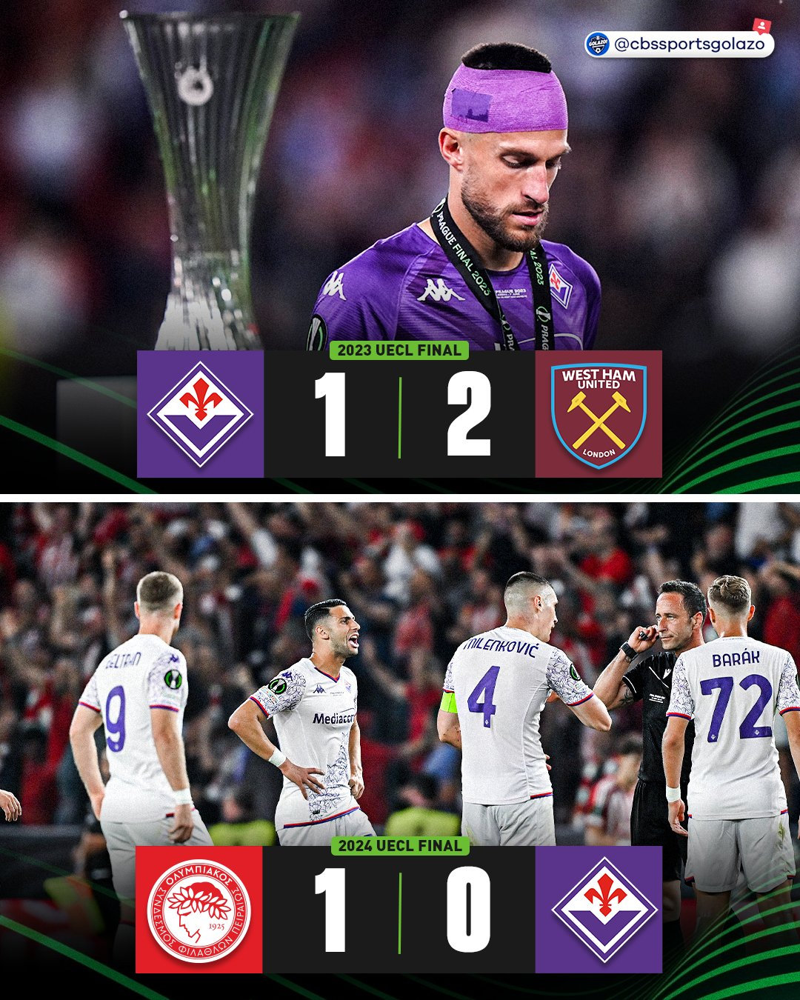

> I believe "Fiorentina" is actually Norse for "play really well until the key moments of your season"

## 从游戏开始的故事

五年前发售的FootballManager 22是我第一次深度游玩这个系列。而佛罗伦萨是我玩过的第一个长期存档，在各个意义上这球队都很适合新手，简单引援即可争冠的阵容，有欧战资格，接近毕业的核心球员，以及一抹骚的一批的紫色。经过五年四代的更迭，佛罗伦萨依旧是我每代必玩的球队。

另一个关注佛罗伦萨的原因是kappa的球衣设计，作为世界上最有品的球衣品牌，kappa设计的22/23赛季佛罗伦萨第三球衣令人眼前一亮，贵气的配色与暗纹设计凸显出俱乐部的古典气质。因为不得不从官网购买，至今这也是我买过最贵的球衣。

> [!note] Tips
> 海外淘球衣还是尽量拼团来分摊运费与过关费，但话又说回来了，真要到了不得不海淘的地步，我估计也成不了团

总的来说我是一个随便的人，之前关注拜仁与阿森纳的出发点也只是觉得队徽顺眼，所谓俱乐部的传奇历史并不很吸引我。不过就算是如此轻浮的原因，也支撑了我在本科四年间持续关注着佛罗伦萨。公平的说现实中的佛罗伦萨远没有游戏中吸引人，22/23赛季是俱乐部近些年的小高潮，意大利诺的传控体系战绩优异，欧协联与意大利杯一路过关斩将打入决赛，但都以最戏剧性的方式倒在了领奖台前。23/24赛季更加磕磕绊绊，一路闯入布达佩斯的欧协联决赛，依旧被绝杀，佛罗伦萨也成了首支欧协联连亚的球队，与瓦伦西亚、本菲卡以及尤文图斯并列欧战亚军连庄之列。

24/25赛季是混乱的序曲，从夏窗开始，时任总监普拉德的糟糕转会节奏使得佛罗伦萨难以及时磨合，尽管新帅帕拉迪诺用一波连胜将球队抬入欧冠区，后续的伤病、冬窗引援的不利与战术失灵使得球队仅仅获得了欧协联资格赛入场券。帕拉迪诺的时代以一个依旧抓马的方式终结，赛季结束后他与俱乐部续约，但旋即与管理层爆发矛盾，愤而辞职。而接下来普拉德与皮奥利的天作之合直接让佛罗伦萨在意甲前15轮难求一胜，同时还耗费了9000w用于转会。最终佛罗伦萨最后一次夺冠时的首发左边后卫保罗瓦诺利及时救火，帮助球队保级，还达成了一项不太光彩的记录。哦对了，在这个动荡的赛季中，老板还死翘翘了，从前一直被认为不关心俱乐部事务的儿子接了班。

如果有人认为这样的球队是充满魅力的，那他一定是个变态，而我可能有点受虐狂倾向。说正经的这支球队我能看到现在更多是因为惯性，当我认识并熟悉每名球员后，继续关注的动力自然而然就产生了。并且严格来说大部分时间的球风还是好看的，这种五大联赛中游球队与顶级球队的区别在于他们常常在某个阶段有特别明显的缺陷，在意大利诺时代，这个缺陷是在进攻三区阵地战的威胁球输送能力，在帕拉迪诺时代则是面对中低位球队时缺乏主导比赛的能力。除此之外还有不少的闪光点，比如意大利诺的后场出球体系与帕拉迪诺的犀利反击。持续看上一段时间后，跟顶级球队的节奏与强度差距也就习惯了。

## 佛罗伦萨的新时代

今年是佛罗伦萨的百年诞辰，尽管被战绩暗淡的低迷冲淡，但整个城市与俱乐部上下从去年开始就进入了为百年诞辰备战的氛围中。球场在修缮，城市张灯结彩，当然球队也要走个面。与球队百年盛典呼应的，是新老板朱塞佩·科米索与新总监帕拉蒂奇的合作，佛罗伦萨一改老科米索时代细水长流扣扣索索的风格，在转会市场上加大投资，进行了多笔2000w以上的引援；而帕拉蒂奇确保这些转会具有针对性，一系列转会下来，球队前场持球能力、中场向前输送能力和整体速度都有了大幅提升。新教练是曾经的伟意左格罗索，他将萨索洛的快速反击带到了佛罗伦萨。

如今这支佛罗伦萨的看点远比前几赛季要足，入坑佛罗伦萨最佳的时机是三十年前，其次是现在。
